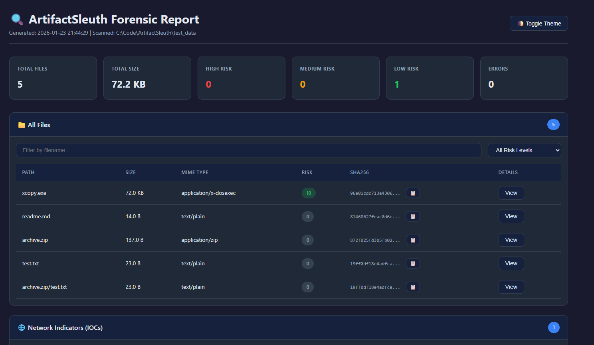

# ArtifactSleuth

**WARNING! This whole tool is vibe coded, before use take time to read through the code because i don't give warranty if it breaks your systems.**

ArtifactSleuth is a Python forensic scanner for removable media. It crawls folders and archives, extracts file intelligence, and produces investigator-friendly HTML or CSV reports with hashes, indicators, and optional VirusTotal enrichment.

## Highlights

- Recursive analysis of folders and archives (ZIP, 7z, RAR, TAR, GZ)
- Hashing (MD5, SHA1, SHA256) with optional VirusTotal lookups
- Document triage for PDF and Office files (macros, scripts, suspicious elements)
- PE analysis for executables (domains, IPs, suspicious imports)
- Reports in HTML (light/dark toggle) or CSV

## Installation

```bash
cd c:\Code\ArtifactSleuth
pip install -r requirements.txt
```

## Quick Start

```bash
python main.py /path/to/usb --output report.html
```

## Report Preview



## Usage Examples

Basic scan (no VirusTotal):
```bash
python main.py /path/to/usb --output report.html
```

VirusTotal (free tier, 4 lookups/min):
```bash
python main.py /path/to/usb --vt-key YOUR_API_KEY --output report.html
```

VirusTotal (premium tier, 500 lookups/min):
```bash
python main.py /path/to/usb --vt-key YOUR_API_KEY --vt-rate 500 --output report.html
```

CSV output:
```bash
python main.py /path/to/usb --format csv --output report.csv
```

Skip VirusTotal lookups:
```bash
python main.py /path/to/usb --no-vt --output report.html
```

Enable file logging:
```bash
python main.py /path/to/usb --log scan_errors.log --output report.html
```

Exclude specific archive types from extraction:
```bash
python main.py /path/to/usb --exclude-archives .apk,.jar --output report.html
```

## What Gets Reported

- Extended metadata: owner, attributes (R/H/S/A), friendly type, computer name
- Digital signatures: Authenticode verification for executables
- File hashes: MD5, SHA1, SHA256
- VirusTotal results: detection ratio and report link
- Document analysis: macros, JavaScript, suspicious elements
- Executable analysis: extracted domains, IPs, suspicious imports
- Archive contents: recursive analysis with full path tracking

## Command Line Options

| Option | Description | Default |
|--------|-------------|---------|
| `path` | Path to scan (folder or file) | Required |
| `--output`, `-o` | Output file path | `report.html` |
| `--format`, `-f` | Output format (`html` or `csv`) | `html` |
| `--log` | Log file path (enables detailed logging) | None |
| `--vt-key` | VirusTotal API key | None |
| `--vt-rate` | VirusTotal rate limit (lookups/min) | 4 |
| `--no-vt` | Skip VirusTotal lookups | False |
| `--no-hash` | Skip file hashing (faster scan) | False |
| `--max-archive-depth` | Max nested archive extraction depth | 5 |
| `--exclude-archives` | Comma-separated archive extensions to skip (e.g., `.apk,.jar,.aar`) | None |
| `--split-report` | Split HTML report into N files each | 0 (disabled) |
| `--quiet`, `-q` | Minimal output | False |

## License

MIT License
